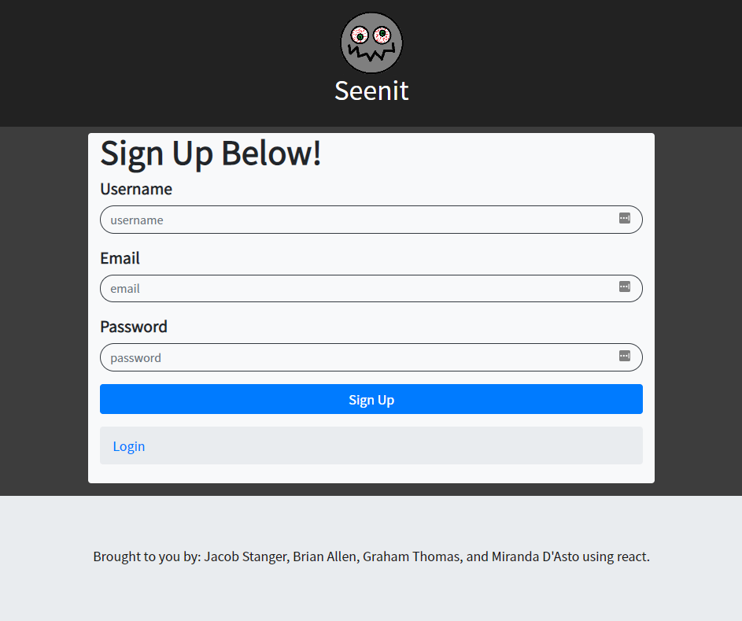
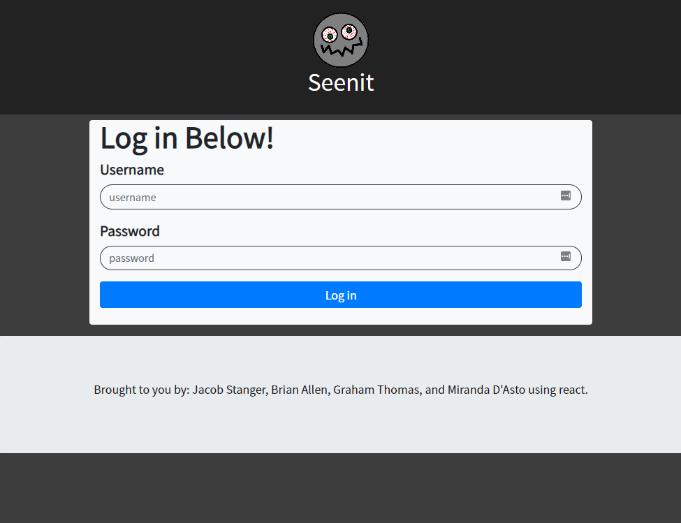
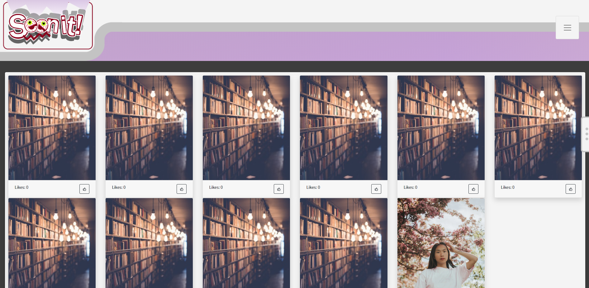
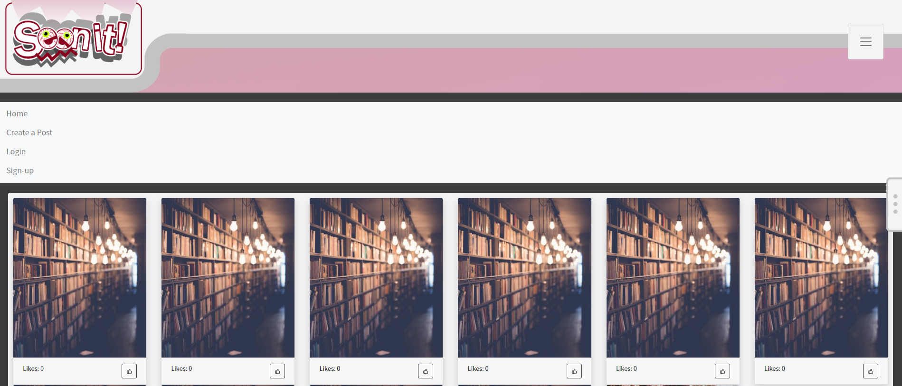
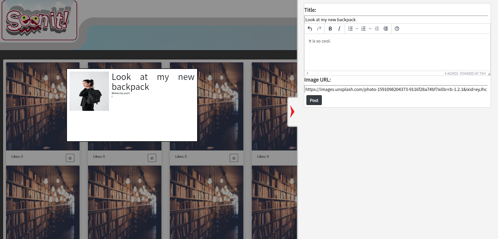
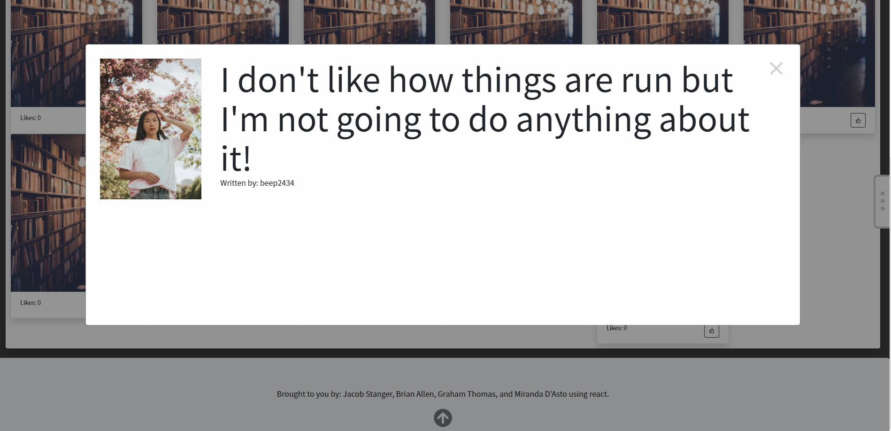
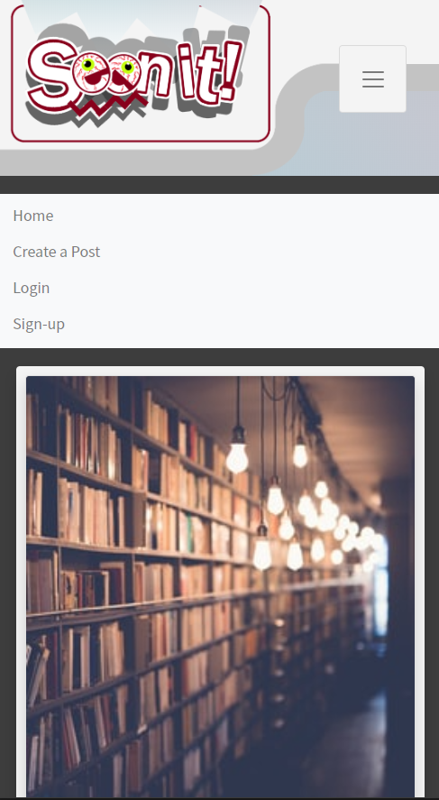

# Seenit - A visual based forum for the curious.
A visual based social media site, where you can post, share, discuss and like your favorite topics and engage and share with others by invoking curiosity through a clean and very visual forward interface.

## Table of Contents

* Application Use
* Technology Used
* Details of the Applicaiton and Challenges
* List of future developments/features
* Link to the Live Project on Heroku
* Screenshots

## Application Use
The application uses ideas from a number of different social platforms and focuses on a visual curiosity as it's driver. The site uses a simple local auth strategy to sign up and login users, and then allows them to view the listed of saved posts. The posts are visual only, with a very clean and easy to take in format. The idea is to invoke curiosity in your content by choosing a good image to represent and draw in users. 

Clicking on a chosen article will open it, allowing the user to review the contents, then returning them to where they left off when they close it. Users can like posts they enjoyed, and the number of likes a post has received is displayed on the main page. Users may also select the create a post option, and can then enter in their own content, which will be posted to the main site for others to review. 

## Technology Used

* [React](https://reactjs.org/)
* [React Hooks](https://reactjs.org/docs/hooks-intro.html)
* [React-Icons](https://www.npmjs.com/package/react-icons)
* [Bootstrap](https://getbootstrap.com/)
* [React-bootstrap](https://react-bootstrap.github.io/)
* [Node js](https://nodejs.org/en/)
* [Express js](https://expressjs.com/)
* [MongoDB](https://www.mongodb.com/)
* [Mongoose](https://mongoosejs.com/)
* [Passport js](http://www.passportjs.org/)
* [Google Fonts](https://fonts.google.com/)
* [Travis CI](https://travis-ci.org)
* [Jest](https://jestjs.io/)
* [Bcrypt js](https://www.npmjs.com/package/bcryptjs)
* [lodash](https://lodash.com/)

## Details of the Application and Challenges

The application lands on a login page as the default. If users do not have a login, they are redirected to the sign up, otherwise they are then taken in to the home page, where the magic happens! The simple user interface shows all of the existing posts. They are represented on the page by images, chosen by the poster to capture what the post is about, and to entice users to examine them further. 

Users have a simple navbar to utilize to move about the site, including going to the home page, the login page, the sign up page, and the create a post option. IF they want to create a post, they can either choose the link in the dropdown navbar, or click on the flyout tab on the right to open up the create a post form. There, they can enter, edit, and preview their posts and then submit them for saving and posting. They are then saved to the database and then rendered. 

Users can examine existing posts with a simple mouseover, which highlights the image and enalrges it a bit so they can both clearly see what they are choosing, and get a better idea of the image. When they choose to click on the post, a modal containing the entirety of the post pops up, allowing them to read, and digest at their leisure. When they close the modal, they are returned to exactly where they left off while browsing. They can also like posts from the main view, and posts show how many have likes each one has currently. 

#### Challenges

Some of the biggest challenges we faced while creating the app were largely in two areas: utilizing the hooks and reducer technology in React, and authentication in passport.js. 

The hooks and reducer where a challenge as they are not as obvious to figure out as simple class and function notation, and require a bit deeper understanding of how React handles states and passing data between the various components. The reducer was fairly complex, but with Jacobs previous dabbling with the tech, as well as some plain trial and error, we ended up getting it working out fairly well, which led to some neat solutions to state management throughout the application. 

Passport was a bit tougher, and in spite of the many hours spent, it proved far more difficult to work with. Miranda spent hours reviewing, revising, and trying to best understand the code required to not only add authentication to the app, but doing so within the React framework, which was a bit more complex than we anticipated. 

## List of future developments/features

* Comments - Ability for users to leave comments on articles and discuss within the opened article page.
* Saved Posts - An interface allowing users to drag and drop items from the home page into a container that saves them to the users unique profile for reviewing at any time. 
* Dislike/Seenit - Ability to either flag a post as boring, or not liked, and have dislikes displayed as well. 
* Search - Ability to search for posts by user, topic, or community. 
* Communities - Add categories to articles like tags and be able to view only content from communities you are interested in. 
* Advanced Auth - Ability to use Github, Twitter, Google or other 3rd party auth instead of just local.
* Permission roles - Ability to view all content without logging in, but restricting posting and commenting to users logged in only. 
* Delete edit posts - This piggy backs off of the Permissions and would allow for either admins, or users to delete posts from the site. Admins could delete at will, and users can delete posts they have made. 

### Link to the Live Project on Heroku: https://not-reddit-seenit.herokuapp.com/

## Screenshots

Sign-up page:

Log-in page:

Home page:

Main page with menu open:

Create post modal:

What post looks like after creation:

What it looks like to read the post:

It's friendly on all size screens:

